# Challenge 1 : détecter les interdots

**Tâche.** Une image de CSD (150 × 150 px) en entrée, un masque binaire des pixels d'interdot en sortie.

**Réponse courte.** Deux détecteurs, deux usages :

- **Partie 1 — régression logistique** sur deux cartes de features (filtre adapté et lissage large) : trois poids et un seuil, sans GPU, interprétable, et la **plus robuste** aux artefacts de mesure que le simulateur ne produit pas.
- **Partie 2 — U-Net** entraîné sur un générateur infini : **bien meilleur dans le simulateur** (92 % → 98 % des interdots trouvés, et 62 % → 96 % sur les frames du challenge 2), mais **plus spécialisé** : il s'effondre sur des pixels aberrants ou un bruit blanc fort qu'il n'a jamais vus.

| | Filtre adapté | Régression logistique | U-Net (lowsnr) |
|---|---|---|---|
| obj F1 (test) | 0,863 | 0,924 | **0,979** |
| tol F1 (pixel ±1 px) | 0,868 | 0,954 | **0,989** |
| obj F1 sur les frames du challenge 2 | 0,14 | 0,62 | **0,96** |
| fausses alarmes par scène vide | **0** | 0,28 | 1,61 |
| robustesse aux artefacts (1 = insensible, § 2.5) | 0,934 | **0,935** | 0,872 |
| paramètres appris | 1 seuil | 3 poids + 1 seuil | 1,9 M |

Mêmes jeux, mêmes métriques, seuils choisis sur val pour toutes les méthodes. Le test (400 scènes) n'est lu qu'une fois.

---

# Partie 1 — Régression logistique

**Réponse courte.** Une **régression logistique** sur deux cartes de features (filtre adapté et lissage large) : trois poids et un seuil, sans GPU ni torch, entraînée en moins d'une minute sur CPU. Sur le test, elle trouve **92 % des interdots** (obj F1 0,924) contre 0,863 pour le meilleur filtre classique, le **filtre adapté**. L'écart est significatif. Parmi les méthodes classiques, elle est la seule utilisable sur les frames bruitées du challenge 2.

| | Régression logistique | Filtre adapté |
|---|---|---|
| obj F1 (test) [IC 95 %] | **0,924** [0,909 ; 0,937] | 0,863 [0,845 ; 0,881] |
| tol F1 (pixel ±1 px) | **0,954** | 0,868 |
| Dice global | **0,555** | 0,430 |
| précision / rappel objet | **0,94 / 0,90** | 0,90 / 0,83 |
| obj F1 sur les frames du challenge 2 | **0,62** | 0,14 |
| fausses alarmes par scène vide | 0,28 | **0** |
| paramètres appris | 3 poids + 1 seuil | 1 seuil |

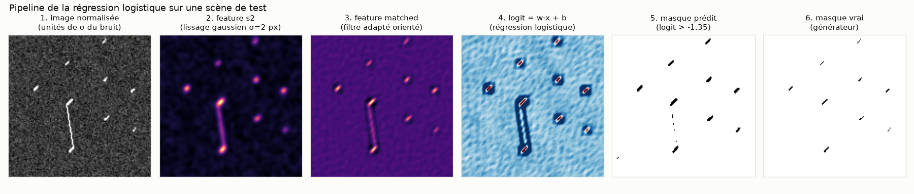

## 1.1 Démarche

On s'est fixé une règle : n'utiliser que ce qu'un expérimentateur voit, c'est-à-dire l'image. L'état caché du simulateur sert uniquement à **noter** les détecteurs. On a donc commencé par des filtres classiques, dont chaque hypothèse se justifie physiquement, avant d'ajouter un peu d'apprentissage, et seulement là où il apporte quelque chose.

#### Prétraitement commun

Toutes les méthodes reçoivent la même image normalisée :

1. On soustrait la médiane de chaque ligne. Cela enlève les stries horizontales de l'axe de scan rapide, et comme les interdots couvrent peu de pixels, la médiane estime bien le fond.
2. On inverse le signe : les interdots, qui sont des creux, deviennent des pics.
3. On divise par le MAD × 1,4826. L'image est alors en **unités de σ du bruit**. Un z-score ferait l'affaire en apparence, mais les sticks brillants le gonfleraient et le SNR absolu serait perdu. Avec le MAD, un même seuil se transporte d'une scène à l'autre.

#### Les détecteurs essayés

Chaque méthode produit une carte de score en σ, puis applique un seuil. Les a priori se cumulent d'une méthode à la suivante. Le détail est dans [`detection/README.md`](detection/README.md).

| | méthode | a priori |
|---|---|---|
| M1 | lissage gaussien | aucun : un interdot est un excès local |
| **M2** | **filtre adapté** | **forme : un bâtonnet court orienté vers π/4 ± 0,2** |
| M3 | crête hessienne | géométrie : une vallée fine |
| M4 | hystérésis | connexité |
| **M5** | **régression logistique** | **combinaison linéaire apprise de ces cartes** |

Trois variantes de M5 ont été fixées **avant** de regarder les résultats : 6 features sans le pixel brut, 7 avec le pixel brut, ou 2 seulement (matched + s2). La version retenue, appelée ici simplement **régression logistique**, est la plus petite : `M5_min` dans le code et dans les tableaux bruts.

#### Pourquoi comparer au filtre adapté

Parmi les filtres sans apprentissage, M1 à M4 ont des obj F1 statistiquement indiscernables (≈ 0,865, l'IC de leur différence contient 0). Pour les départager, on prend le critère de sélection du protocole, (obj F1 + tol F1)/2 sur val : le **filtre adapté** arrive en tête (0,845, contre 0,79 au plus pour les autres). C'est aussi la référence du bootstrap apparié. La comparaison reste honnête, puisque la régression logistique **contient** le filtre adapté et ne lui ajoute qu'une seule feature.

---

## 1.2 Ce que la régression logistique apprend

Le modèle tient en une ligne (features standardisées, fit sur 500 images de `data/train`, seed 0) :

```
logit = +8,01 · matched  −4,57 · s2  −4,96      pixel d'interdot si logit > −1,35
```

- **matched** est la réponse du filtre adapté : *« ça ressemble à un bâtonnet orienté »*.
- **s2** est l'image lissée à σ = 2 px : *« il y a beaucoup de signal dans un grand voisinage »*.

Le poids de s2 est **négatif**. À réponse de filtre égale, le modèle se méfie des zones où il y a trop de signal à grande échelle, c'est-à-dire des **lignes de charge**. Elles sont longues et brillantes et répondent au filtre adapté, mais elles ne sont pas des interdots. La figure ci-dessous le montre : le filtre adapté coupe à la verticale (`matched > 8,74`), alors que la régression logistique coupe en oblique. Elle accepte des interdots faibles (matched ≈ 5) tant que s2 reste bas, et rejette le nuage gris du haut, qui vient des lignes de charge.

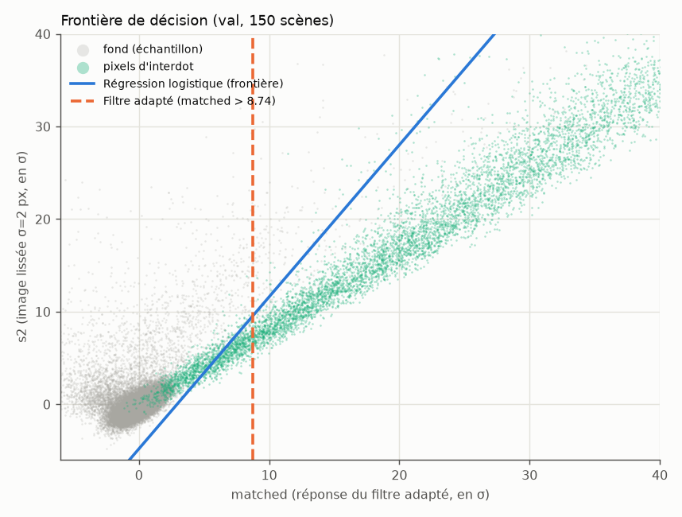

---

## 1.3 Masques prédits

Couleurs : **vert** = pixel prédit correct à ±1 px, **rose** = fausse alarme, **jaune** = pixel d'interdot manqué.

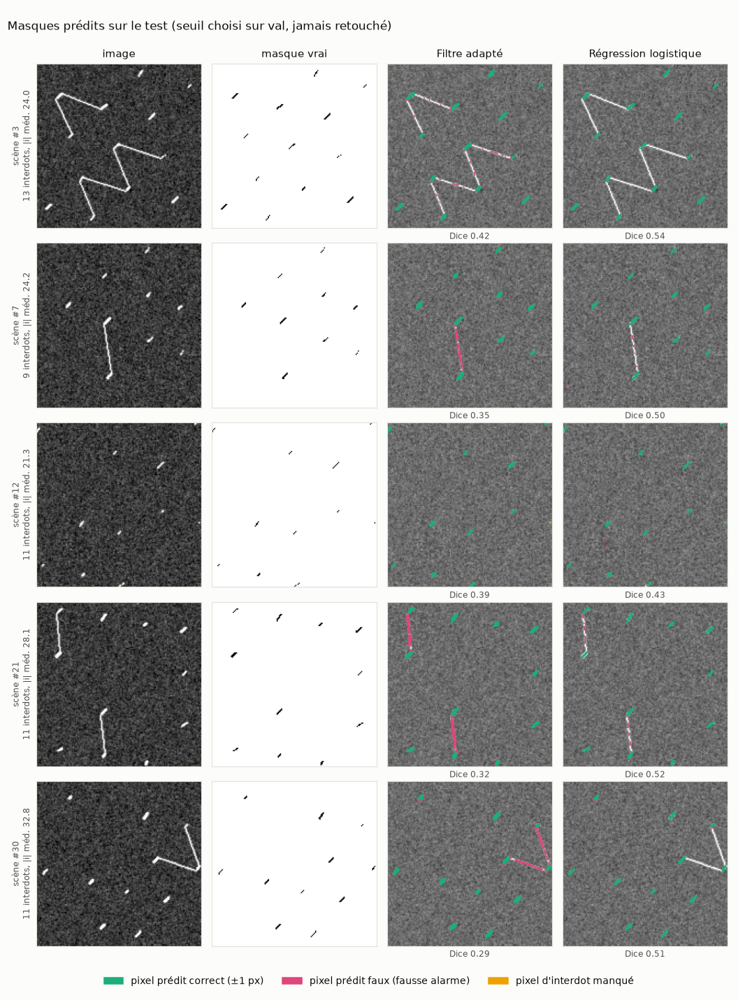

Ce qu'on voit :

- Les deux méthodes trouvent presque tous les interdots isolés.
- Le filtre adapté s'allume en **rose** sur les lignes de charge (scènes #7, #21, #30). La régression logistique les rejette en grande partie, grâce au poids négatif de s2.
- Le Dice reste autour de 0,5 même quand le résultat est visuellement très bon : on explique pourquoi en § 1.4.

Sur des frames du challenge 2, où le contraste est faible (|i| ≈ 3σ), l'écart devient énorme. Le filtre adapté ne voit presque plus rien, tandis que la régression logistique en retrouve la moitié avec le même seuil :

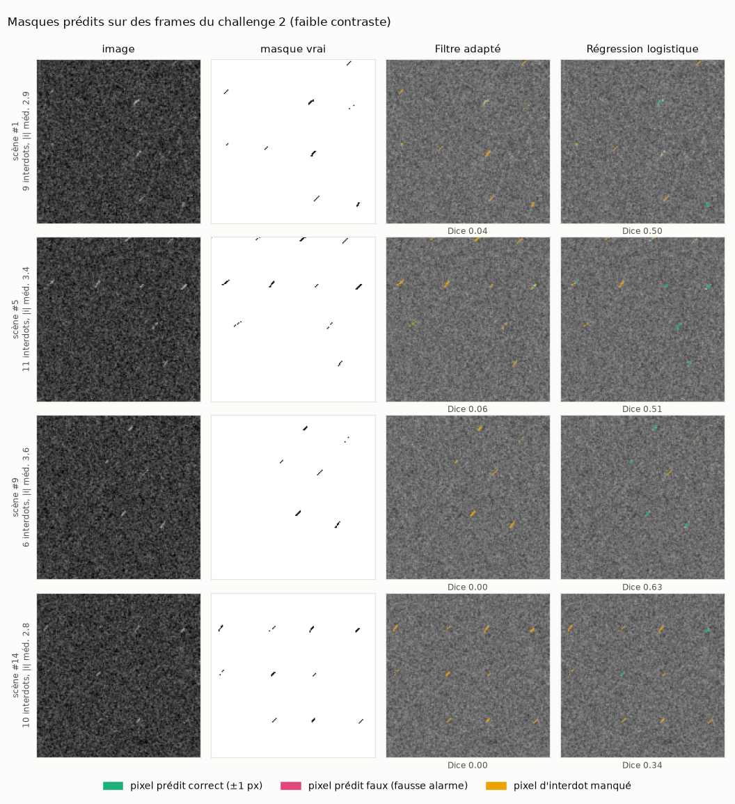

---

## 1.4 Les métriques, et pourquoi on n'en garde pas qu'une

Le masque officiel vient d'un rectangle flou de 1 à 2 px seuillé à 0,5. Il est donc **fragmenté** (environ 2,5 morceaux par interdot) et sa largeur est arbitraire. Une métrique pixel stricte mesure surtout la chance de rastérisation. On rapporte donc trois niveaux :

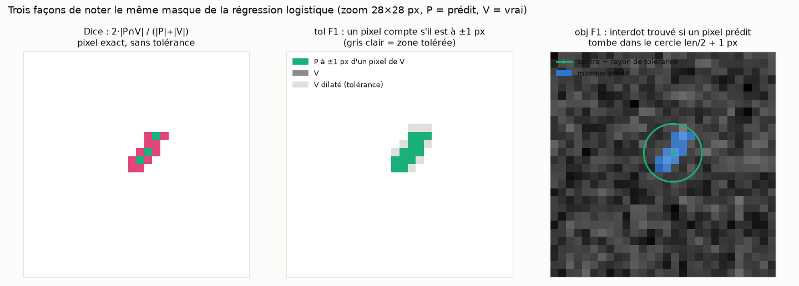

| métrique | définition | question à laquelle elle répond |
|---|---|---|
| **Dice** (= F1 pixel strict) | 2·\|P∩V\| / (\|P\|+\|V\|), sans tolérance. *Global* : pixels cumulés sur tout le jeu. *Par image* : moyenne des Dice de chaque image | ai-je copié le masque au pixel près ? |
| **tol F1** | précision : part des pixels prédits ayant un pixel vrai dans leur voisinage 3×3 ; rappel : l'inverse ; F1 = moyenne harmonique | ai-je dessiné le trait au bon endroit, à 1 px près ? |
| **obj F1** | rappel : un interdot est *trouvé* si un pixel prédit tombe à moins de len/2 + 1 px de son centre ; précision : un blob prédit (fragments fusionnés par dilatation 3×3) est *correct* si son centroïde est à moins de len/2 + 2 px d'un interdot | **ai-je trouvé les interdots ?** C'est ce qui compte pour l'expérimentateur |

Garde-fous complémentaires :

- **ratio de largeur** = pixels prédits / pixels vrais. Il détecte un masque trop gras qui gonflerait le rappel pixel.
- **blobs par interdot trouvé**. Il détecte une détection fragmentée qui gonflerait la précision objet.
- **fausses alarmes sur des scènes vides** (sans interdot). C'est le taux de faux positifs pur.
- **IC 95 % par bootstrap** sur les images, et bootstrap **apparié** contre le filtre adapté pour savoir si un écart est réel.

**Pourquoi on ne sélectionne pas sur le Dice.** Dans les variantes, le meilleur Dice (0,89, `M5_full`) appartient au modèle qui copie le mieux la largeur du masque. C'est aussi celui qui s'effondre au challenge 2 (0,33). Choisir le seuil par le Dice fait chuter l'obj F1 des filtres de 0,86 à 0,5–0,75 ([`results/selection_dice/`](results/selection_dice/baselines.md)). Le seuil est donc choisi par **(obj F1 + tol F1)/2 sur val**, et le Dice n'est rapporté qu'à titre indicatif.

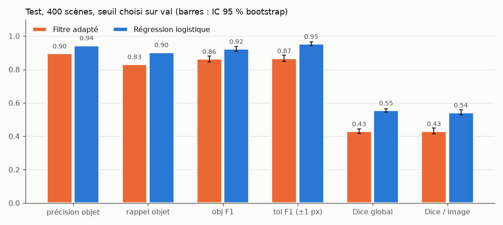

---

## 1.5 Robustesse et limite de détection

Le seuil choisi sur val est **figé**, puis appliqué tel quel à des jeux décalés (orientation, bruit, zoom, frames du challenge 2). Ces jeux servent uniquement au rapport, jamais à une sélection.

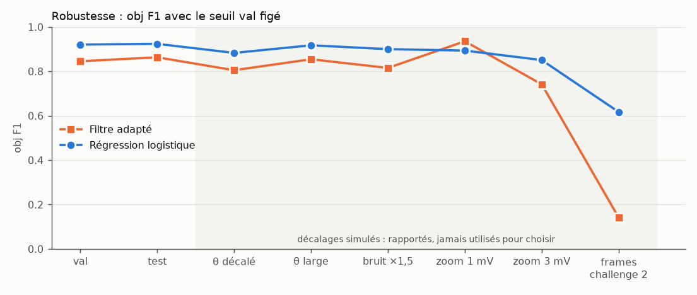

La régression logistique est au-dessus ou à égalité partout. La seule exception est le zoom fin à 1 mV, où les interdots deviennent plus gros que le gabarit du filtre. L'écart le plus net concerne les frames du challenge 2 : **0,62 contre 0,14**.

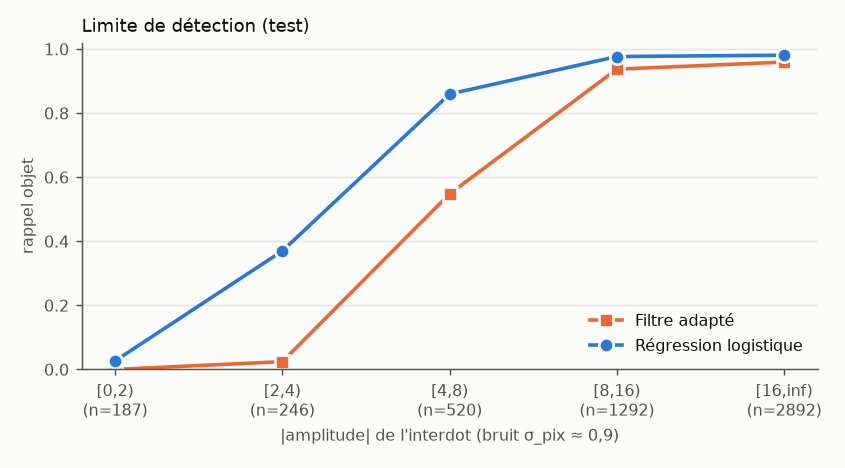

La limite de détection apparaît clairement. En dessous de 2σ, aucune méthode ne voit rien, ce qui est attendu. Entre 2σ et 8σ, la régression logistique récupère beaucoup plus d'interdots (0,86 contre 0,55 sur [4, 8)). C'est précisément le régime du challenge 2.

---

## 1.6 Vers le challenge 2 : le seuil doit être recalibré

Le seuil appris sur des images contrastées (|i| ~ U(1, 33)) n'est plus optimal sur les frames du challenge 2 (|i| ≈ 3). Un balayage du seuil sur le logit le montre ([`../challenge2/transfer_m5/`](../challenge2/transfer_m5/sweep.py)) :

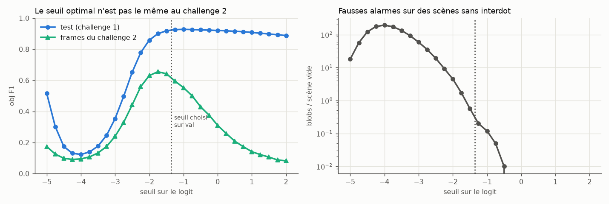

- Au challenge 1, le plateau est large, de −1,5 à +1. Le seuil −1,35 est bon.
- Au challenge 2, le maximum (0,66) est à −1,75, et l'obj F1 retombe vite au-delà.
- On ne peut pas régler ce seuil avec les labels du challenge 2. On le fixe donc par le **taux de fausses alarmes sur des scènes vides**, une quantité mesurable sur une vraie puce : −2,0 donne ≈ 4,5 blobs parasites par scène et −2,5 en donne ≈ 19. Ce sont les variantes `bo_m5_fa5` et `bo_m5_fa20` du challenge 2.
- Le fond du logit a la même loi sur tous les jeux (médiane −5,3, σ ≈ 1). Le seuil n'est donc pas « mal calibré » : c'est le SNR des interdots au point de départ du challenge 2 qui limite. Une fois branchée dans l'optimiseur, la régression logistique ne bat pas le filtre du challenge 2. Le détail est dans [`../challenge2/transfer_m5/README.md`](../challenge2/transfer_m5/README.md).

---

## 1.7 Garde-fous du protocole

| # | garde-fou | piège évité |
|---|---|---|
| S1 | fit sur `data/train` (seed 0) ; val, test et OOD sur des seeds disjointes, vérifiées par hachage des images | fuite entre splits |
| S2 | un seul paramètre libre par méthode, le seuil, choisi **sur val** ; tous les autres hyperparamètres sont fixés a priori par la physique | sur-réglage |
| S3 | test, OOD et scènes vides scorés **une seule fois** ; les labels du simulateur ne servent qu'à l'évaluation | sélection sur le test |
| S4 | IC bootstrap, bootstrap apparié, 3 seeds de fit pour la régression logistique (écart-type < 0,001) | différences non significatives |
| S5 | ratio de largeur, blobs par interdot, fausses alarmes sur scènes vides | triche sur les métriques |
| S6 | parité exacte avec `detection.metrics.object_scores` | bug de métrique |

Le test d'une première version (seed 2025) avait été regardé : il est **brûlé**, et cette version est archivée dans [`archive/v1_methodes_faciles/`](archive/v1_methodes_faciles/README.md).

**Limites.** Tous les décalages sont simulés. Les jeux OOD (150 scènes) n'ont pas d'IC. La régression logistique produit 0,28 blob parasite par scène vide, contre 0 pour les filtres. Les temps (≈ 10 ms/image) incluent toute la pile de features.

---

# Partie 2 — Deep learning : U-Net et TransUNet

**Question.** Un réseau entraîné sur un générateur infini fait-il mieux que la régression logistique, et surtout : **reste-t-il bon hors du simulateur ?** On compare deux architectures qui encadrent l'axe « localité » : le **U-Net** (CNN pur, biais local maximal) et le **TransUNet** (encodeur CNN + attention globale sur le réseau d'interdots). Deux autres transformers ont été essayés puis écartés (ViT : 6× plus lent et le moins robuste ; SegFormer : rappel le plus faible à bas SNR).

| | Régression logistique | **U-Net** (lowsnr) | **TransUNet** (lowsnr) |
|---|---|---|---|
| obj F1 (test, 400 scènes) | 0,924 | **0,979** | **0,979** |
| tol F1 / Dice global | 0,954 / 0,555 | 0,989 / 0,983 | 0,989 / 0,983 |
| précision / rappel objet | 0,94 / 0,90 | 0,995 / 0,964 | 0,996 / 0,963 |
| obj F1 sur les frames du challenge 2 | 0,62 | **0,964** | 0,954 |
| fausses alarmes par scène vide | **0,28** | 1,61 | 1,32 |
| score de robustesse (§ 2.5, 1 = insensible) | **0,935** | 0,872 | 0,863 |
| paramètres | 3 poids + 1 seuil | 1,9 M | 5,9 M |
| inférence | ~10 ms/img (CPU) | ~2 ms/img (GPU) | ~2,6 ms/img (GPU) |

**En une phrase.** Dans le simulateur, le DL écrase la méthode classique (+0,055 en obj F1, ×1,6 au challenge 2) ; hors du simulateur, il est **moins robuste** qu'elle (pixels aberrants, bruit blanc fort, polarité) : c'est un détecteur excellent mais spécialisé, à utiliser avec un garde-fou (§ 2.6). L'attention globale du TransUNet n'apporte rien : le **U-Net**, 3× plus petit, est retenu.

Les poids sont dans [`models/`](models/) (`unet_lowsnr.pt` 3,9 Mo, `transunet_lowsnr.pt` 11,9 Mo, float16, seuil choisi sur val inclus).

---

## 2.1 Données : un générateur infini, mais des géométries finies

Le générateur officiel est lent (0,17 s/scène, boucles Python) : en génération à la volée, le GPU attendrait. Or une image se décompose exactement, parce que le flou est linéaire :

```
image = i · template + flou(σ_pix · blanc + σ_h · rayures)
```

On pré-calcule donc **30k géométries** (`template` = rendu propre divisé par l'intensité, et le label soft), et à chaque batch on **retire sur GPU** l'intensité `i ~ U(−33, −1)` et le bruit. Aucune image n'est vue deux fois ; seules les géométries reviennent (≈ 4 passages en run court).

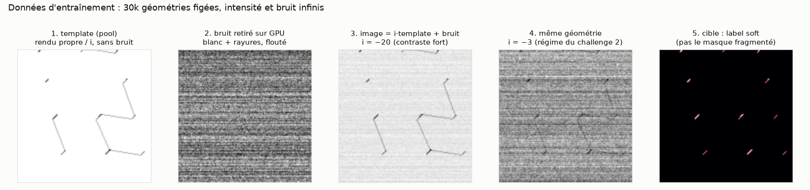

Contrôles avant tout entraînement (`detection.data_gen verify`) :

| | bruit officiel (image − rendu propre) | bruit synthétique GPU |
|---|---|---|
| écart-type pixel | 0,807 | 0,807 |
| écart-type des moyennes de lignes (rayures) | 0,565 | 0,564 |
| autocorrélation lag-1 horizontale / verticale | 0,617 / 0,259 | 0,617 / 0,255 |
| fraction de pixels d'interdot | 0,00344 (val) | 0,00341 (pool) |

Ce n'est **pas** une rétro-ingénierie du bruit : on lit les paramètres publics de `GeneratorConfig` pour produire plus vite exactement ce que `generate_data.py` produirait. Seeds disjointes par construction : pool [0, 30k), val 1e7+k, test 2e7+k, OOD 3e7+…

## 2.2 Entraînement et pièges évités

| piège | parade |
|---|---|
| interdots **sous-pixel** (0,4–1,6 px de large), 0,35 % de positifs | pas de patch 16 ; tête pleine résolution nourrie par l'image brute ; perte BCE + Dice global |
| masque officiel **fragmenté** (seuil 0,5 d'un rectangle flou) | on apprend le **label soft**, pas le masque binaire |
| flips H/V **non physiques** (θ = π/4 → −π/4) | seul le groupe exact {id, transposée, rot180, anti-transposée}, appliqué **avant** le bruit (les rayures restent horizontales) |
| z-score gonflé par les sticks brillants | normalisation médiane / MAD : le réseau voit des σ de bruit, comme la partie 1 |
| **fuite de sélection** | checkpoint (EMA) et seuil choisis **sur val uniquement**, test et OOD lus une fois |
| **critère de sélection trichable** | trouvé en cours de route : le tol F1 seul vaut 1,0 pour un masque **dilaté d'1 px** (un run l'a atteint, F1 strict 0,50). Sélection corrigée en **(obj F1 + tol F1)/2**, comme la partie 1 |
| comparaison injuste entre architectures | même données, même perte, même éval ; **même temps de calcul** (~30 min A5000) : U-Net 14k steps, TransUNet 9k steps × batch 32 |

Optimiseur AdamW (lr 1e-3 U-Net, 5e-4 TransUNet, warmup 300, cosinus), bf16, clip 1,0, poids EMA 0,999.

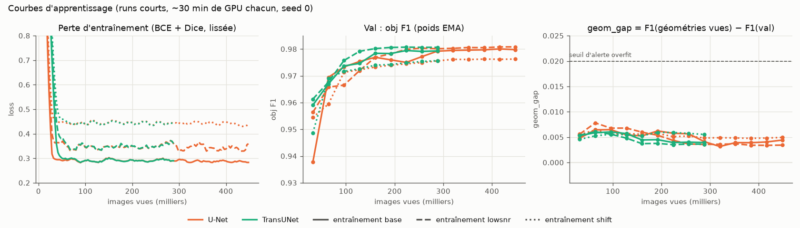

- Tout se joue avant ~150k images ; ensuite le val plafonne à 0,98.
- **`geom_gap`** = F1 sur des géométries du pool (bruit neuf) − F1 sur val : il reste entre +0,003 et +0,008, loin du seuil d'alerte (0,02), et ne grandit pas. **Pas de mémorisation des géométries** ; val (0,981) ≈ test (0,979), donc pas de biais de sélection.

## 2.3 Masques prédits, comparés au générateur

Mêmes scènes et même code couleur que la partie 1 (vert : correct à ±1 px ; rose : fausse alarme ; jaune : manqué). Colonne 2 = le masque produit par le générateur.

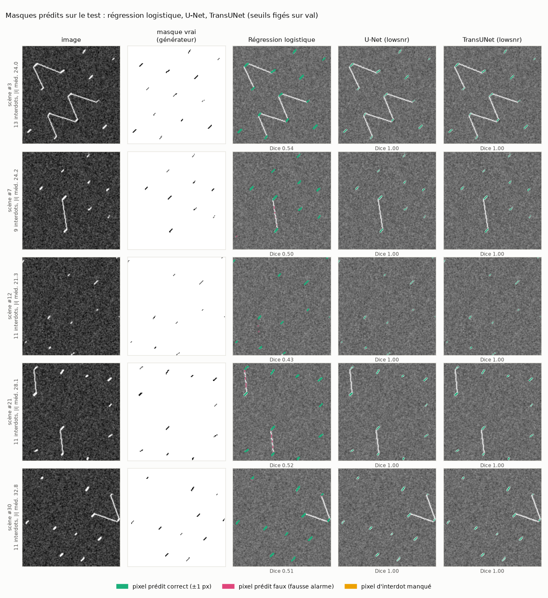

- Les deux réseaux retrouvent tous les interdots, **sans s'allumer sur les lignes de charge** que la régression logistique coupe en rose.
- **Dice 1,00** : le réseau reproduit le masque du générateur au pixel près, y compris sa largeur arbitraire et sa fragmentation. C'est excellent pour les métriques, mais c'est aussi le premier signe d'une **spécialisation au générateur** : il a appris sa règle de rastérisation (la partie 1 montrait déjà que copier la largeur du masque ne dit rien de la physique).

Sur les frames du challenge 2 (contraste |i| ≈ 3σ), l'écart avec la partie 1 est le plus net :

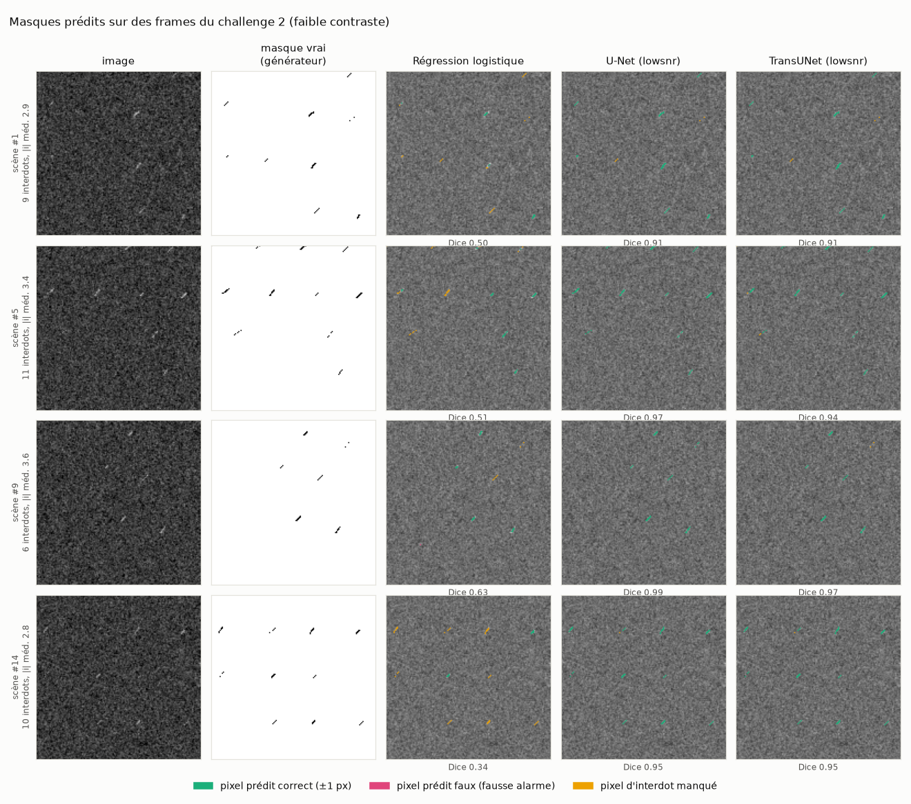

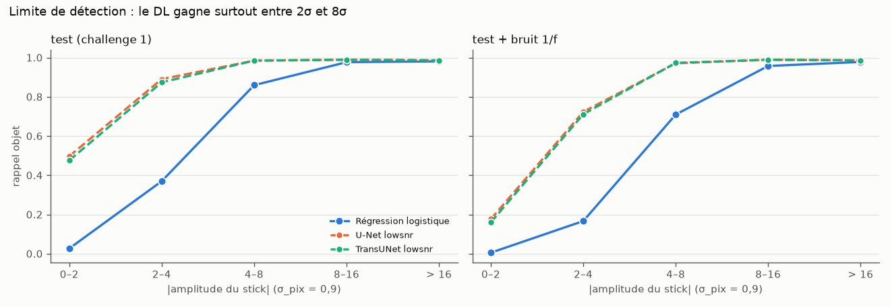

Le gain du DL est concentré entre 2σ et 8σ : rappel 0,87–0,89 contre 0,37 sur [2, 4). Sous 2σ, rien ne voit les sticks (0,50 au mieux).

## 2.4 Variantes d'entraînement (phase P4 du protocole)

Un seul facteur change à la fois, toujours sur le même pool :

- **lowsnr** : |i| tiré log-uniforme sur le même support → ~40 % de scènes sous |i| = 4 (au lieu de ~9 %), le régime du challenge 2 ;
- **shift** : échelle anisotrope + cisaillement (autres résolutions et bras de levier), polarité aléatoire, niveau de bruit × U(0,7 ; 1,3).

Le même P4 a été appliqué à la régression logistique (ré-ajustement de ses poids sur les mêmes jeux décalés, [`results/p4_m5/`](results/p4_m5/p4_m5.md)).

## 2.5 Le processus de robustesse

On veut savoir si un détecteur a appris **les interdots** ou **le simulateur**. Trois niveaux de test, du plus proche au plus éloigné de l'entraînement, avec les mêmes règles partout :

1. **seuil et checkpoint figés sur val**, jamais retouchés ;
2. jeux **de rapport uniquement** : aucune sélection, aucun ajustement dessus ;
3. **mêmes images, mêmes labels** que le test quand c'est possible : une baisse ne peut venir que de la perturbation.

### Niveau 1 — le générateur, paramètres décalés (OOD simulés)

`detection.data_gen sets` : autre pente des sticks (π/4 + 0,35), jitter de pente ×3, bruit ×1,5, pas de 1 mV et 3 mV, frames du challenge 2 (dérive + contraste par région, un autre chemin de rendu).

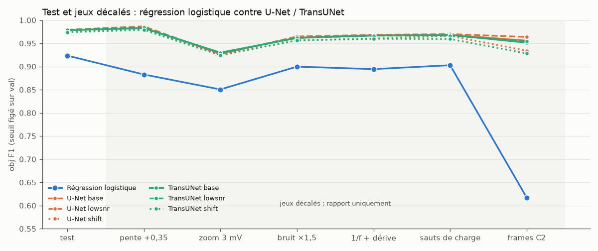

Le DL perd peu (≤ 0,05, au zoom grossier) et reste 0,05 à 0,35 au-dessus de la régression logistique. **lowsnr** est la seule variante qui aide partout (challenge 2 : 0,956 → 0,964) sans coût sur le test. **shift** coûte un peu partout : l'interpolation affine affaiblit les labels de 1 px de large (fraction de positifs binarisés 0,36 % → 0,20 %), un biais de l'augmentation elle-même.

### Niveau 2 — artefacts de mesure que le générateur ne produit jamais

[`detection/robustness.py`](detection/robustness.py) construit `data/robustness/` : les 200 premières scènes du test, chacune dégradée par **un** artefact de laboratoire, à 3 niveaux. Le temps est l'ordre raster (lignes = axe de scan rapide).

| artefact | origine physique | niveaux |
|---|---|---|
| bruit blanc ajouté | intégration plus courte | × 0,5 / 1 / 2 σ_pix |
| bruit 1/f le long du scan | bruit de charge, amplificateur | × 0,5 / 1 / 2 σ_pix |
| dérive lente du fond | dérive du point capteur | crête-crête 1,5 / 3 / 6 |
| sauts télégraphiques (~4 / image) | piège de charge près du capteur | amplitude 1,5 / 3 / 6 |
| rayures supplémentaires | gigue ligne à ligne | × 0,5 / 1 / 2 σ_h |
| passe-bas 1 pôle sur l'axe rapide | constante de temps du lock-in | τ = 0,5 / 1 / 2 px |
| pixels aberrants ±10 | glitchs, parasites | 0,1 / 0,5 / 2 % des pixels |
| saturation c·tanh(x/c) | flanc fini du pic de Coulomb | c = 10 / 5 / 2,5 |
| polarité inversée | capteur sur l'autre flanc | — |

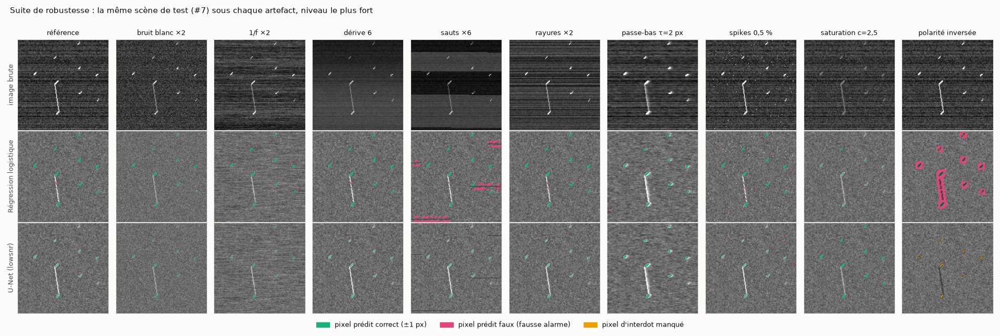

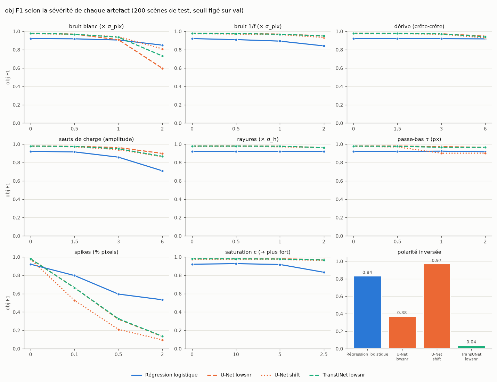

**Score de robustesse** = moyenne, sur tous les artefacts et niveaux, de obj F1(perturbé) / obj F1(propre) :

| méthode | obj F1 propre | robustesse | points faibles |
|---|---|---|---|
| Régression logistique | 0,921 | **0,935** | spikes (0,53 à 2 %), sauts ×6 (0,71) |
| U-Net base / lowsnr / shift | 0,979 / 0,980 / 0,974 | 0,870 / 0,872 / **0,888** | spikes (0,12 à 2 %), bruit blanc ×2 (0,54–0,81), polarité (0,62 / 0,38 / 0,97) |
| TransUNet base / lowsnr / shift | 0,978 / 0,979 / 0,974 | 0,875 / 0,863 / **0,892** | idem ; polarité lowsnr 0,04 |

Lecture :

- **En absolu, le DL reste meilleur sur 6 artefacts sur 9** (1/f, dérive, sauts, rayures, passe-bas, saturation), souvent sans broncher (≥ 0,95 au niveau le plus fort).
- **Mais il se dégrade plus, en relatif, et s'effondre là où il n'a rien vu de semblable** : quelques **pixels aberrants** (0,1 % suffit : 0,98 → 0,66) deviennent des interdots, et un **bruit blanc ×2** le fait tomber sous la régression logistique (0,60 contre 0,85). Le prétraitement de la partie 1 (médiane par ligne, MAD, filtres moyennés) encaisse ces deux cas beaucoup mieux.
- **La polarité est un a priori, pas une capacité.** Sans augmentation, le réseau ne détecte pas des sticks positifs (0,04 à 0,62, selon ce qu'il a appris du fond) ; avec `shift`, qui la randomise, 0,97. La régression logistique code le signe en dur dans son prétraitement.
- **Les variantes shift sont les plus robustes** (0,89), malgré leur léger coût sur le test : élargir la distribution d'entraînement paie. **lowsnr** est la meilleure dans la distribution et au challenge 2.

### Niveau 3 — le DL est-il plus « spécifique » que le classique ?

Oui, et c'est mesuré : à SNR égal, la régression logistique (3 paramètres, un prétraitement physique) n'a presque rien à apprendre par cœur ; ses pertes s'expliquent par la physique du bruit (le filtre adapté, qui n'apprend rien, chute pareil sur le 1/f). Le réseau, lui, a appris la statistique exacte du simulateur, jusqu'à sa règle de rastérisation (Dice 1,00).

## 2.6 Comment pallier

Par ordre de coût, en gardant toujours au moins une famille d'artefacts **jamais vue** pour l'évaluation (sinon on se ment) :

1. **Prétraitement physique avant le réseau** (aucun réentraînement) : dé-spiking (filtre médian 3×3 sur les pixels isolés à |z| > 6), soustraction de la médiane par ligne, signe fixé par l'expérimentateur à partir du flanc du pic de Coulomb. C'est exactement ce qui rend la régression logistique robuste.
2. **Élargir l'entraînement** (domain randomization) : bruit blanc de 0,5× à 2,5×, pixels aberrants, polarité, 1/f, passe-bas. Évaluer en *leave-one-family-out* : entraîner sans les sauts, tester sur les sauts, et inversement.
3. **Garde-fou hybride** : n'accepter un blob du réseau que si le filtre adapté voit aussi un excès local, ou basculer sur la régression logistique quand les statistiques du résidu sortent de celles de l'entraînement (MAD du bruit, fraction de pixels |z| > 6, désaccord entre seeds). Un détecteur qui dit « hors domaine » vaut mieux qu'un détecteur qui invente des interdots.

## 2.7 Limites

- **Un seul seed par variante** dans les runs courts : les écarts de ~0,005 entre variantes ne sont pas significatifs ; les écarts DL / régression logistique (0,05 au test, 0,35 au challenge 2) et les effondrements de robustesse le sont.
- Tous les artefacts restent **synthétiques** : seules de vraies données diraient si la suite couvre la réalité.
- Le DL produit **1,3 à 1,9 fausse alarme par scène vide** contre 0,28 : à recalibrer (taux de fausses alarmes) avant de l'utiliser comme objectif au challenge 2, comme en § 1.6.
- La suite de robustesse n'a pas d'IC (200 scènes par jeu).

---

## Reproduire

Depuis la racine du repo :

```bash
uv sync
uv run python hackathon/starter/stage1_detection/generate_data.py --n 2000 --out data/train
uv run python -m detection.baselines                     # partie 1, ~4 min ; le 1er run génère data/eval_light (~15 min)
uv run python -m detection.baselines --select dice --out challenge1/results/selection_dice
uv run python -m detection.export_m5                      # fige la régression logistique pour le challenge 2
uv run python challenge1/figures/make_figures.py          # figures de la partie 1
```

Partie 2 (machine GPU ; `uv sync --extra train`) :

```bash
uv run python -m detection.data_gen pool --n 30000 --out data/pool --workers 32      # ~15 min CPU
uv run python -m detection.data_gen sets --out data/eval --workers 32
uv run python -m detection.data_gen verify --pool data/pool --eval data/eval        # bruit GPU = bruit officiel ?
uv run python -m detection.train --arch unet --seed 0 --steps 14000 --warmup 300 --eval-every 1000 --compile --intensity-law loguniform --out runs/fast_unet_lowsnr
uv run python -m detection.train --arch transunet --seed 0 --steps 9000 --warmup 300 --eval-every 1000 --compile --intensity-law loguniform --out runs/fast_transunet_lowsnr
#   variantes : sans option (base) ; --affine --polarity --noise-jitter 0.3 (shift)
uv run python -m detection.evaluate --runs "runs/fast_unet*" "runs/fast_transunet*" --eval-dir data/eval_light --out challenge1/results/dl_p4
uv run python -m detection.export_dl runs/fast_unet_lowsnr challenge1/models/unet_lowsnr.pt
uv run python -m detection.robustness make                                           # data/robustness (numpy seul)
uv run python -m detection.robustness eval-m5                                        # régression logistique sur la suite
uv run python -m detection.evaluate --runs "runs/fast_unet*" --eval-dir data/robustness --out challenge1/results/robustness   # DL sur la suite (val/ et test/ en liens)
uv run --extra train python -m detection.make_fit_sets data/pool data/fit_p4 500        # jeux d'ajustement P4 (même pool)
uv run python -m detection.p4_m5                                                     # P4 appliqué à la régression logistique
uv run python challenge1/figures/make_figures_dl.py                                  # figures de la partie 2
```

Utiliser un modèle exporté (l'image seule entre, rien du simulateur) :

```python
from detection.export_dl import load, predict_mask
model, thr = load("challenge1/models/unet_lowsnr.pt", device="cuda")
masks = predict_mask(model, thr, images, device="cuda")   # images : (N, H, W) CSD bruts
```

## Contenu du dossier

| chemin | contenu |
|---|---|
| [`detection/`](detection/) | code. Partie 1 : `baselines.py` (5 détecteurs, protocole, métriques), `metrics.py`, `export_m5.py`. Partie 2 : `data_gen.py` (pool + jeux figés), `synth.py` (bruit GPU), `models.py`, `train.py`, `evaluate.py`, `export_dl.py`, [`PROTOCOL.md`](detection/PROTOCOL.md). Robustesse : `robustness.py`, `p4_m5.py`, `make_fit_sets.py`, `make_real_noise.py` |
| [`models/`](models/) | U-Net et TransUNet (lowsnr) figés : poids EMA float16 + seuil choisi sur val |
| [`results/`](results/README.md) | partie 1 : `baselines.md` / `.json`, `m5_min_params.json` ; partie 2 : `dl_p4/` (test + OOD), `transformers/logs/` (courbes, évals par run), `robustness/` (suite d'artefacts, DL et régression logistique), `p4_m5/` |
| [`figures/`](figures/) | figures du README (`fig1`–`fig8` partie 1, `fig9`–`fig16` partie 2) et leurs scripts |
| [`archive/`](archive/) | v1 (test brûlé), première démo M5 |

Correspondance des noms : **régression logistique = `M5_min`**, **filtre adapté = `M2_matched`** ; runs DL `fast_<arch>[_lowsnr|_shift]`.
