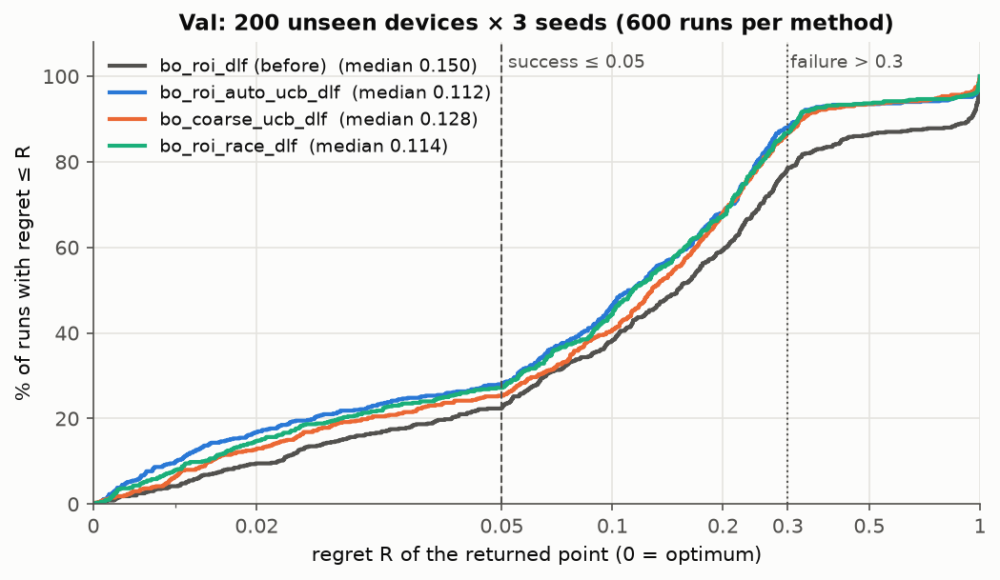
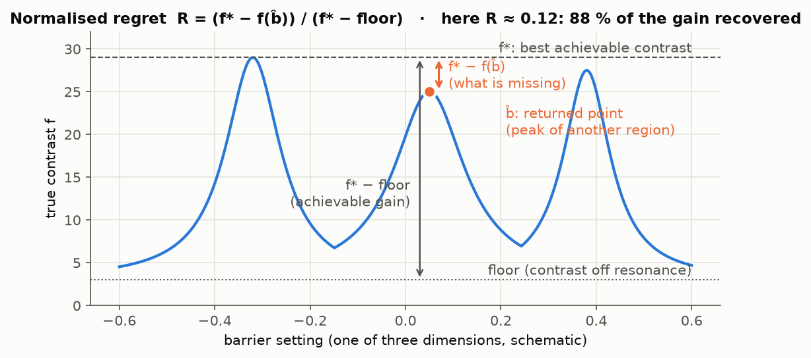
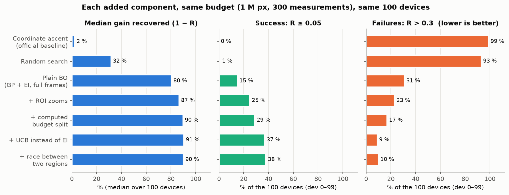
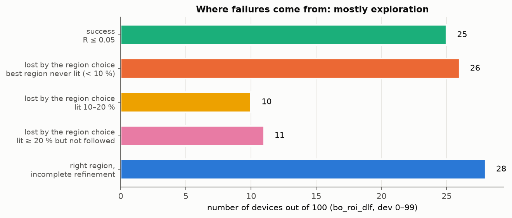
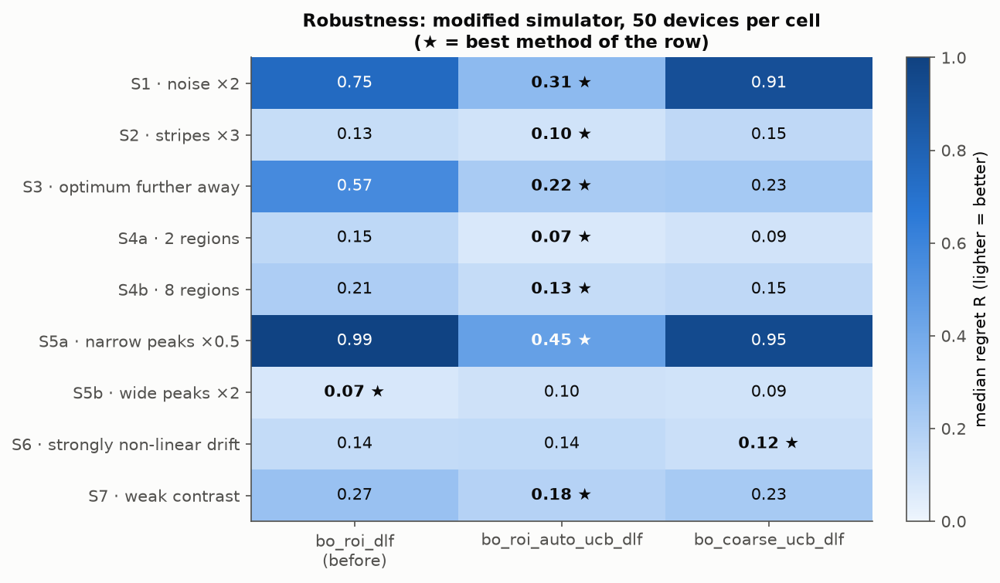
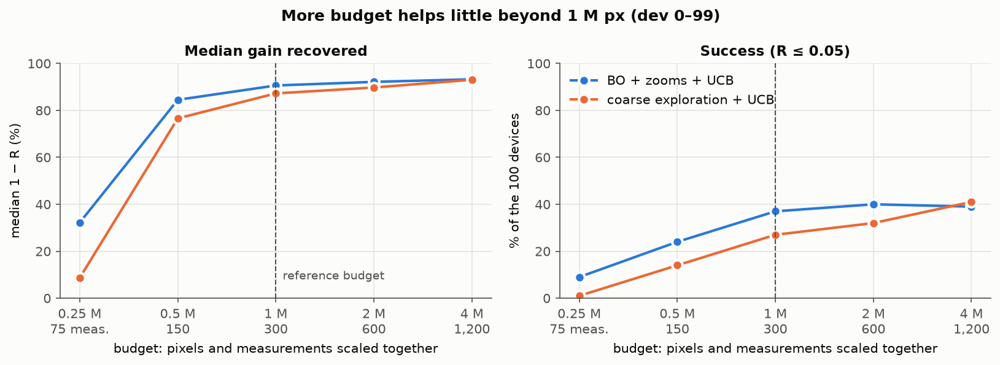
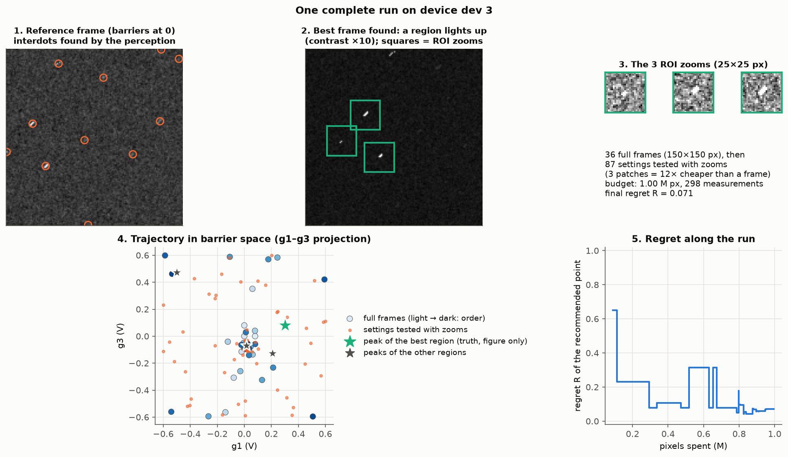

# Challenge 2: finding the setting that maximises interdot contrast

> **Status.** The retained method is confirmed on 100 fresh devices (dev 900–999) and on the **val** split (200 devices × 3 seeds). The **test** split (10000–10199) has never been run: it will be run once, on a frozen commit.

**The task.** An unknown simulated device has five gates. The barriers g1, g3, g5 set the contrast of the interdots and also shift the image; the plungers g2, g4 move the measurement window. The goal is to return the setting (g1…g5) where an interdot has the highest contrast, measuring as little as possible and never reading the hidden state of the simulator.

**The deliverable.**

```python
from csd import new_experiment
from solve import optimize

exp = new_experiment()        # fresh device, hidden optimum
gates = optimize(exp)         # {"g1": ..., "g2": ..., "g3": ..., "g4": ..., "g5": ...}
```

[`solve.py`](solve.py) runs the retained method with the reference budget (1 M pixels, 300 measurements) and returns the committed setting.

## Contents

1. [Main result](#1-main-result)
2. [Measuring success: the metrics and why these ones](#2-measuring-success-the-metrics-and-why-these-ones)
3. [How the architecture evolved](#3-how-the-architecture-evolved)
4. [Robustness beyond the default simulator](#4-robustness-beyond-the-default-simulator)
5. [What is more budget worth?](#5-what-is-more-budget-worth)
6. [One run in pictures](#6-one-run-in-pictures)
7. [Negative results](#7-negative-results)
8. [Protocol, data and reproducibility](#8-protocol-data-and-reproducibility)
9. [Limitations and next steps](#9-limitations-and-next-steps)
10. [Running the code and folder contents](#10-running-the-code-and-folder-contents)

---

## 1. Main result

Budget fixed before any method was written: **1 M pixels and 300 measurements per device**, about 44 full 150 × 150 px frames, roughly 7 times less than the baseline provided by the organisers.

**Val: 200 devices never used for any decision, 3 algorithm seeds, 600 runs per method.**

| method | median regret R | median gain recovered | within 5 % of the optimum | within 10 % | failures (R > 0.3) | paired ΔR vs before [95 % CI] | p (Holm) |
|---|---|---|---|---|---|---|---|
| `bo_roi_dlf` (previous method) | 0.150 | 85 % | 22 % | 38 % | 22 % | | |
| **`bo_roi_auto_ucb_dlf`** (retained) | **0.112** | **89 %** | **28 %** | **46 %** | **12 %** | **−0.018 [−0.038, −0.010]** | **3·10⁻⁷** |
| `bo_coarse_ucb_dlf` | 0.128 | 87 % | 25 % | 41 % | 13 % | −0.037 [−0.067, −0.008] | 1·10⁻⁴ |
| `bo_region_ucb_dlf` | 0.128 | 87 % | 25 % | 42 % | 16 % | −0.017 [−0.027, −0.000] | 0.002 |
| `bo_roi_race_dlf` | 0.114 | 89 % | 27 % | 44 % | 13 % | −0.023 [−0.032, −0.008] | 1·10⁻⁵ |
| `bo_roi_meta_dlf` | 0.145 | 86 % | 26 % | 40 % | 20 % | +0.003 [−0.016, +0.011] | 0.43 |

The retained method recovers a median **89 % of the achievable contrast gain**, returns a setting within 10 % of the optimum on almost one device in two, and **halves the failures**. It is the best method in 7 of the 9 shifted simulator configurations (section 4), which is what separated the two finalists.



How to read the curve: for each value of R on the x axis, the share of runs that do at least as well. The earlier the curve rises, the better. The gap between the previous method (grey) and the UCB methods shows mostly on the right: heavy failures have almost disappeared.

---

## 2. Measuring success: the metrics and why these ones

### What we want to measure

The true contrast of a setting b is the factor f(b) that the simulator applies to the best interdot. It is at least a **floor** (3 in the default configuration: every interdot stays faintly visible) and at most **f\***, the peak of the best region (between 23 and 33 depending on the device). The algorithm never sees f; only the evaluation code reads it, once the run is over.

### First idea, rejected: distance to the optimum in voltage space

Measuring ‖b̂ − b\*‖ looks natural, but a device has four regions whose peaks are close: on 39 % of devices, the two best ones differ by less than 5 %. Returning the peak of the second region then costs very little contrast but a huge distance in voltage space. The distance would punish an almost perfect answer. We therefore measure **in contrast**, not in volts.

### Second idea, rejected: raw contrast f(b̂) or the ratio f(b̂)/f\*

The ratio f(b̂)/f\* is intuitive but flattering: since f never goes below the floor, any setting already scores about 10 % of f\*. And f\* changes from one device to the next, which makes averages hard to compare.

### The main metric: normalised regret



$$R = \frac{f^* - f(\hat b)}{f^* - \text{floor}}$$

- **R = 0**: the exact optimum was returned. **R = 1**: no progress over the floor.
- **1 − R** reads as the **share of the achievable contrast gain** actually obtained.
- Normalising by (f\* − floor) makes devices comparable.
- R is computed at the **committed point** b̂, the one the algorithm returns at the end after re-measuring it on fresh frames. Never at the best point visited by chance: we evaluate what the algorithm would claim, not what it happened to cross.

### Indicators derived from R

| indicator | definition | what it tells |
|---|---|---|
| **median regret** | median of R over runs | typical performance, insensitive to a few extreme runs |
| **mean regret** | mean of R | penalises failures, complements the median |
| **success** | share of runs with R ≤ 0.05 | "the optimum was found", within 5 % of the gain |
| **within 10 %** | share of runs with R ≤ 0.1 | a looser criterion, useful given the near-ties between regions |
| **failures** | share of runs with R > 0.3 | runs that return a clearly bad setting; often what matters most to an experimentalist |
| **budget curve** | R of the recommended point after 250 k, 500 k, 1 M pixels | speed: when does the algorithm start being useful? |
| **correct region** (diagnostic) | is the region that dominates at b̂ the best one? | used to explain failures, never to rank methods |

### The cost: the budget

Every measurement costs lab time. The task statement proposes **pixels** as the measure of that time. We also count **measurements**, because each change of setting requires waiting for the device to settle: without this second limit, a thousand 100-pixel images would look free. Both limits (1 M pixels, 300 measurements) are enforced by a gatekeeper, [`BlindExperiment`](optimization/blind.py), which counts, refuses any measurement that would exceed them, and never exposes the hidden state. The values are orders of magnitude fixed in the [protocol](PROTOCOL.md) before writing the methods; section 5 shows what a larger budget gives.

### Comparing two methods without fooling ourselves

- **Pairing**: all methods run on the same devices. We compare device by device (ΔR = R_method − R_reference), which removes the variance between easy and hard devices.
- **Confidence interval** of the median ΔR by bootstrap (5,000 resamples).
- **Wilcoxon** signed-rank test, then **Holm correction** over all comparisons of a table: the more methods we try, the more evidence we need to call one better.
- Tool: [`evaluation/compare.py`](evaluation/compare.py).

---

## 3. How the architecture evolved

The thread is simple: at each step, a measured diagnosis says where the loss is, and the next step targets that loss and nothing else.



### Step 0: the provided baseline and its traps

The organisers' baseline runs a coordinate ascent on `img.std()`. It almost always fails (median gain 2 %), for two physical reasons we measured before writing any method ([PROTOCOL.md](PROTOCOL.md), section 1):

- **drift**: moving a barrier shifts the interdots by 0.66 V (median) for a 0.3 V window. Without re-centring, the interesting region leaves the image and the score drops, which wrongly looks like "bad contrast";
- **the score**: `img.std()` over the whole image mixes background, noise and stripes, while contrast lives on a few interdot pixels.

### Step 1: the common foundation, without which nothing works

All the following methods share this foundation ([`optimization/session.py`](optimization/session.py)):

1. **Firewall and budget**: the algorithm sees the device only through `BlindExperiment`.
2. **Perception**: find the interdots in each image (challenge-1 U-Net, or a bank of oriented filters) and read their amplitude.
3. **Drift tracking**: a reference frame and three small probes (one per barrier) measure how the image shifts; a drift model is then refined with every registered image. The plungers g2, g4 are no longer decision variables: they are computed to keep the interdots centred. The problem goes from 5 to 3 dimensions, as with "virtual gates" in the lab.
4. **Trust region**: we only measure where the drift is predictable to 25 mV; the explorable zone grows with the model.
5. **Per-interdot score**: each interdot's amplitude is divided by its own floor, then we take the maximum, shrunk by one noise standard deviation against the winner's curse.

### Step 2: which decision algorithm?

With this foundation, what remains is choosing where to measure next in the three-barrier space. At equal budget we compared representatives of each classical family of derivative-free optimisation:

| family | method | median gain | success |
|---|---|---|---|
| chance | random search, keep the best | 32 % | 1 % |
| direct search | CMA-ES | 39 % | 2 % |
| estimated gradient | SPSA + Adam | 56 % | 3 % |
| probabilistic model | **Bayesian optimisation (GP + EI)** | **80 %** | **15 %** |

Bayesian optimisation wins clearly, as expected: with forty or so costly, noisy measurements, you need a model that remembers every measurement and knows where it does not know. A Gaussian process (Matérn 5/2 kernel, one length scale per barrier, per-measurement noise) models the score; an acquisition rule picks the next point. Nothing is trained in advance: the GP is fitted online to the device's own measurements and starts from scratch on the next device.

### Step 3: perception is not the bottleneck

Our challenge-1 detector (LOFO U-Net, object F1 0.98) replaces the classical filter for finding interdots. Result: same regret on full frames (0.193 vs 0.194). The filter already finds the interdots well enough to track the drift, and the amplitude is read by the same filter in both cases. The U-Net halves tracking losses (0.3 vs 0.6 per run), which is why we keep it, but the loss is elsewhere.

### Step 4: zooms (active measurement)

**Observation**: a full frame costs 22,500 pixels, while once the right region is found only three interdots matter. **Idea**, borrowed from adaptive imaging and ray-based acquisition for quantum dots (Lennon et al. 2019, Zwolak et al. 2021): after the search phase, measure only three small 25 × 25 px patches centred on the predicted positions, at the same step so amplitudes stay comparable. A setting then costs 12 times less, and the same budget buys about 250 fine settings instead of a handful. **Effect**: success from 15 % to 25 %, failures from 31 % to 23 %.

### Step 5: splitting the budget by computation

**Observation**: the previous version switched to zooms at 40 % of the pixel budget. The zooms then used up the 300 measurements while 37 % of the pixels were never spent. **Idea**: before each new full frame, check whether the pixels left afterwards exceed what the zooms can spend with the remaining measurements; if so, one more search frame is free. The switch is no longer a hand-tuned parameter but a consequence of the two limits. **Effect**: about 35 search frames instead of 18, success 29 %, failures 17 %.

### Step 6: exploring more (UCB)

**Diagnosis.** The evaluation code can split the regret of a run into two parts: the loss due to **the choice of region** and the loss due to **refinement** within the chosen region.



Out of 100 devices, 47 lose more than 5 % because of the region choice, and in 26 of them the best region was **never** lit during the search. The loss comes from exploration, not refinement. A control confirms it: even with 4 times more pixels, the best region is visited in only 30 % of runs. The problem is not the number of frames but where they are placed.

**Explanation.** The EI rule (expected improvement) favours places with a real chance of beating the current record. On a landscape that is flat almost everywhere with four narrow peaks, it stays around the first peak it finds. The **UCB** rule (upper confidence bound, μ + 2σ, Srinivas et al. 2010) treats an unseen zone as potentially excellent until it has been visited: optimism in the face of uncertainty. The coefficient 2 is the standard value, fixed before the test.

**Effect**: success 37 %, failures 9 % on dev 0–99 (Holm p 0.005), confirmed on 100 fresh devices (success 39 % vs 22 %, Holm p 4·10⁻⁴) and then on val.

### Step 7: four ideas to push exploration further

Each one targets a specific part of the diagnosed loss; each is judged on dev 0–99, then on 100 fresh devices.

| idea | rationale | dev 0–99: R / success / failures | dev 900–999: R / success / failures | decision |
|---|---|---|---|---|
| **per-region model** | one GP per spatial group of interdots instead of one GP on the maximum, so that a second region lighting up is not masked by the first (targets 11 devices where the best region lit up without being followed) | 0.083 / 34 % / 11 % | 0.133 / 30 % / 14 % | not better than UCB alone |
| **coarse exploration** | frames at 2× step, 4 times cheaper, for about 100 search points instead of 35 (targets the 26 never-lit devices) | 0.128 / 27 % / 9 % | **0.064 / 43 % / 10 %** | best on fresh devices, but fragile to noise (section 4) |
| **race between two regions** | during the zooms, alternate between the best region and a second one, then keep the winner | 0.099 / 38 % / 10 % | 0.092 / 36 % / 14 % | selected by the pre-registered rule, but identical to UCB alone on val (ΔR +0.001, p = 0.94): not kept |
| **meta-learned policy** | replace the acquisition rule by 8 weights learned with CMA-ES on ~31,000 simulated episodes, observable reward only | 0.105 / 26 % / 18 % | | does not transfer to val |

**Why `bo_roi_auto_ucb_dlf` is retained.** The pre-registered rule (best paired gain on fresh devices among the methods significant on dev 0–99) pointed to the race between two regions. On val it performs exactly like UCB alone (paired ΔR +0.001, p = 0.94), so the simpler method is kept; it is also the only one whose robustness was measured. Coarse exploration is the strongest on fresh devices, but it relies on low-resolution frames that lose the signal when the noise doubles or the peaks get narrower: its median regret then rises to 0.91 and 0.95, against 0.31 and 0.45 for the retained method (section 4). On a real chip, whose noise and peak shape are not those of the simulator, we prefer the method that degrades least.

---

## 4. Robustness beyond the default simulator

The methods were designed on the default configuration. To estimate what would happen on a real chip, we modify the simulator following scenarios S1–S7 of the protocol, without retraining or retuning anything, 50 devices per cell.



- The retained method is the best in 7 rows out of 9. In the other two (wide peaks, strongly non-linear drift), the gap to the best is 0.03 in median regret.
- Doubled noise (S1) and twice narrower peaks (S5a) remain hard for every method: the needle gets thinner or more buried, and the budget is no longer enough to find it. The retained method keeps a median regret of 0.31 and 0.45 there, while the others reach 0.75 to 0.99.
- Coarse exploration collapses exactly in those two cases, which guided the final choice.

---

## 5. What is more budget worth?

Pixels and measurements are scaled together, in the same ratio (250 k pixels and 75 measurements, …, 4 M pixels and 1,200 measurements).



| budget | median gain | success | within 10 % | failures |
|---|---|---|---|---|
| 250 k px, 75 measurements | 32 % | 9 % | 13 % | 65 % |
| 500 k px, 150 measurements | 85 % | 24 % | 39 % | 26 % |
| **1 M px, 300 measurements** | **91 %** | **37 %** | **52 %** | **9 %** |
| 2 M px, 600 measurements | 92 % | 40 % | 55 % | 8 % |
| 4 M px, 1,200 measurements | 93 % | 39 % | 63 % | 5 % |

(retained method, dev 0–99)

Everything happens between 250 k and 1 M pixels, the time needed to calibrate the drift and then find a bright region. Beyond that, quadrupling the budget adds only 2 points of median gain: the remaining difficulty is to **tell apart four close peaks**, which would require finding all of them. The 1 M pixel reference budget sits just past the knee.

---

## 6. One run in pictures



1. The reference frame and the interdots found in it: this map is then used to track the drift.
2. The best frame found during the search: a region lights up, its contrast is multiplied by 10. The squares are the three zooms of the next phase.
3. The three ROI zooms: each costs 625 pixels instead of 22,500.
4. The trajectory in barrier space. The search covers the box, then the zooms concentrate. The stars (ground truth, drawn for the figure only) show that the algorithm chose a region whose peak is very close to that of the best one: final regret 0.07.
5. The regret of the recommended point along the run: nothing useful during calibration, a sharp drop when a region is found, then refinement.

---

## 7. Negative results

They are part of the approach; each one taught us something.

| attempt | result | lesson |
|---|---|---|
| challenge-1 U-Net instead of the filter | same regret, tracking twice as reliable | the bottleneck is not vision |
| PFN: a transformer pre-trained on synthetic landscapes replaces the GP | regret 0.68, close to chance, although it beats the GP offline | a misspecified learned prior costs more than it brings |
| meta-learned policy (8 weights, CMA-ES, ~31,000 simulated episodes, observable reward) | large progress on its own reward (+5 score units), no gain on val (p = 0.43) | optimising an intermediate objective (the observable score at the end of phase 1) is not enough: the gap between that objective and the final regret absorbed everything |
| CMA-ES instead of the GP during the zooms | identical (p = 0.25) | once the region is chosen, the decision algorithm matters little |
| switch to zooms "as soon as a region lights up" | identical | floor noise already reaches the threshold, so the criterion always fires |
| coarse exploration with fewer fine frames | not significant on dev, worse on fresh devices | fine frames are needed for tracking, they cannot be cut much |
| coarse exploration + per-region model | significant on dev 0–99 (Holm p 0.015), only 25 % success on fresh devices | the two ideas do not add up |
| challenge-1 M5 detector at its original threshold | tracking breaks | see [`transfer_m5/`](transfer_m5/README.md) |

---

## 8. Protocol, data and reproducibility

- **Protocol written before the methods**: [PROTOCOL.md](PROTOCOL.md) fixes the metrics, the budget, the physical traps and the abandonment criteria.
- **Fixed device splits** ([`evaluation/seeds.py`](evaluation/seeds.py)):
  - dev 0–99: design and screening;
  - dev 100–999: training of the learned methods (PFN, meta-learned policy);
  - dev 900–999: confirmation on fresh devices, added during the improvement phase;
  - val 1000–1199: final comparison of the candidates, 3 seeds;
  - test 10000–10199: untouched, run once at the end.
- **Decision rule written before seeing the results** ([`results/NIGHT_LOG.md`](results/NIGHT_LOG.md)): an idea comes from a diagnosis, its parameters are fixed in advance (no sweep), it must win on dev 0–99 and then on 900–999, and every attempt, failures included, is logged.
- **Honesty about val**: val was used to compare several candidates. It therefore acts as a selection set, and only the test split will give a figure free of selection bias.
- **Firewall**: the optimisation code does not import the simulator and never touches `reveal` or `_sim` (checked by the tests). Only [`evaluation/`](evaluation/) reads the ground truth, to score.
- **No hidden reward**: the meta-learned policy is trained on a score the algorithm can measure itself, never on the true contrast.
- **One device per process**, each algorithm with its own random generator: the simulator draws its noise from NumPy's global generator, and interleaving devices would silently corrupt the measurements.

---

## 9. Limitations and next steps

- **Everything is simulated.** Transfer is estimated with scenarios S1–S7, not measured on a real chip.
- **The budget is an order of magnitude.** On a real chip it would depend on the integration time per pixel and on the gate settling time.
- **Four close peaks remain the difficulty.** Even with a quadrupled budget, about 40 % of devices are solved within 5 %. The two most promising directions:
  - combine coarse exploration and the race between regions, adapting the resolution to the measured noise so as not to lose robustness;
  - a learned policy that chooses the **type** of measurement (fine frame, coarse frame or zoom) and not only its location, trained directly on an objective closer to the final regret.
- **Doubled noise and narrow peaks** (S1, S5a) remain cases where no method finds the optimum with this budget.

---

## 10. Running the code and folder contents

```bash
uv run python challenge2/solve.py                                     # one device, end to end
uv run python -m evaluation.run --methods bo_roi_dlf bo_roi_auto_ucb_dlf --split dev --n 100 --workers 8 --out challenge2/results/run.jsonl
uv run python -m evaluation.compare --ref bo_roi_dlf challenge2/results/run.jsonl
uv run python -m evaluation.run --methods bo_roi_auto_ucb_dlf --split dev --n 50 --shift S1 --out challenge2/results/rob_S1.jsonl
PYTHONPATH=challenge2:hackathon:challenge1 python challenge2/figures/make_figures.py
```

The challenge-1 U-Net is used when `C12_DL_CKPT` points to its checkpoint (GPU extra `uv sync --extra train`); otherwise the training-free perception takes over, with equivalent regret (section 3, step 3).

| path | contents |
|---|---|
| [`solve.py`](solve.py) | entry point `optimize(exp)` |
| [`PROTOCOL.md`](PROTOCOL.md) | protocol written before the methods |
| [`optimization/`](optimization/) | firewall, perception, tracking, score, and all methods (`methods/`) |
| [`evaluation/`](evaluation/) | the only code that reads the ground truth: regret, diagnosis, shifted configurations, paired comparisons |
| [`training/`](training/) | PFN and meta-learned policy |
| [`figures/`](figures/) | figures of this README and the script that rebuilds them |
| [`results/`](results/) | raw `*.jsonl` files, [`BENCH_C2.md`](results/BENCH_C2.md), attempt log [`NIGHT_LOG.md`](results/NIGHT_LOG.md) |
| [`transfer_m5/`](transfer_m5/README.md) | transfer of the challenge-1 logistic regression |
