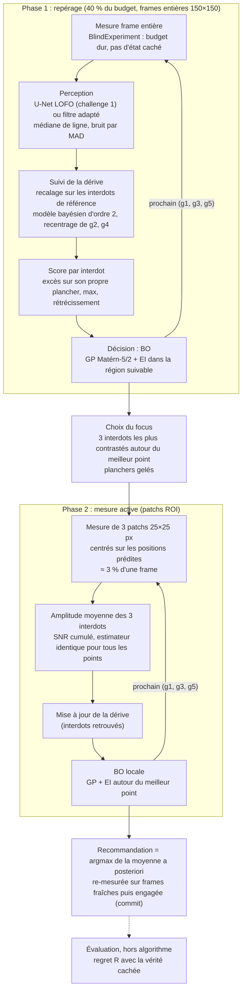

# Challenge 2 : maximiser le contraste des interdots

> **Statut.** Méthode retenue et confirmée sur le split **val** (200 dispositifs jamais utilisés pendant la conception). Le split **test** (10000–10199) n'a pas encore été lancé : il servira une seule fois, sur un commit gelé, pour le chiffre final.

**Tâche.** Trouver les tensions de barrières (g1, g3, g5) qui maximisent le contraste des interdots d'un dispositif simulé inconnu, avec un budget de mesure limité et sans accès à l'état caché du simulateur.

## Architecture

C'est l'architecture standard de l'autotuning de boîtes quantiques : une boucle fermée modulaire (mesure → perception → estimation d'état → décision ; cf. Zwolak & Taylor, *Rev. Mod. Phys.* 2023). Nous y ajoutons un module de **mesure active** emprunté à l'imagerie adaptative (Lennon et al. 2019 ; acquisition « ray-based », Zwolak et al. 2021).



| module | fichier | rôle |
|---|---|---|
| Pare-feu + budget | [`optimization/blind.py`](optimization/blind.py) | expose seulement `measure`, `scan_1d`, `start`, `extent` ; `BudgetExceeded` au-delà de 1 M px ou 300 mesures |
| Perception | [`optimization/perception.py`](optimization/perception.py), [`optimization/detector.py`](optimization/detector.py) | banc de filtres orientés ; détecteur optionnel figé du challenge 1 (`M5Min`, `DLDetector`) |
| Suivi de la dérive | [`optimization/tracking.py`](optimization/tracking.py), [`optimization/session.py`](optimization/session.py) | sondes de levier, recalage, modèle de dérive, région de confiance |
| Score | [`optimization/scoring.py`](optimization/scoring.py) | excès par interdot sur son plancher, max avec rétrécissement, planchers gelables |
| Décision | [`optimization/methods/bo.py`](optimization/methods/bo.py), [`gp.py`](optimization/methods/gp.py) | GP numpy, EI, recommandation par la moyenne a posteriori |
| **Mesure active** | [`optimization/methods/bo_roi.py`](optimization/methods/bo_roi.py) | phase 2 : patchs ROI sur les interdots du focus, BO locale |
| Évaluation | [`evaluation/`](evaluation/) | seul code qui lit la vérité ; regret, courbes en fonction du budget, splits de seeds |

**Pourquoi la mesure active.** Le diagnostic expérimental montre que la limite est le SNR de l'estimation du contraste, pas la détection : un détecteur à F1 0,98 n'améliore pas la BO sur frames entières. Un patch de 25×25 px coûte 3 % d'une frame au même pas, donc les amplitudes restent comparables : le même budget achète environ 10 fois plus d'évaluations là où se trouve l'information.

## Résultats

Métrique : regret normalisé R = (f* − f(b̂)) / (f* − plancher) au point **engagé** (0 = optimum, 1 = aucun gain), médiane sur les dispositifs, comparaisons appariées (IC bootstrap de ΔR médian, Wilcoxon). Budget 1 M px. Détail complet : [`results/BENCH_C2.md`](results/BENCH_C2.md).

**Val, 200 dispositifs (confirmation, lancée une seule fois) :**

| | frames entières | patchs ROI |
|---|---|---|
| **filtre adapté** | `bo` : R@500k 0,52 · **R@1M 0,227** · succès 15 % | `bo_roi` : R@500k 0,22 · **R@1M 0,175** · succès 20 % (p = 0,0097) |
| **U-Net LOFO** | `bo_dlf` : R@500k 0,54 · **R@1M 0,233** · succès 17 % (p = 0,42) | **`bo_roi_dlf`** : R@500k **0,19** · **R@1M 0,170** · succès **22 %** (p = 2,6·10⁻⁵) |

Le p compare chaque case à `bo` ; succès = R ≤ 0,05.

- **La méthode retenue (`bo_roi_dlf`) récupère en médiane 83 % du gain de contraste possible**, et deux fois plus vite que la BO : R = 0,19 dès 500 k px, contre 0,52.
- **La mesure active fait l'essentiel du gain.** Le U-Net seul n'apporte rien sur frames entières. Combiné aux patchs, il fiabilise le repérage (0,3 échec de suivi par run contre 0,6), pour un gain marginal : ΔR −0,004 [−0,015 ; +0,001], p = 0,046.
- **Résultats négatifs documentés :** PFN entraîné sur prior synthétique (R = 0,68, quasi aléatoire, alors qu'il bat le GP hors ligne : prior mal spécifié) ; détecteur M5 au seuil du challenge 1 (suivi qui décroche, [`transfer_m5/`](transfer_m5/README.md)) ; zooms en fenêtre englobante (`bo_mf`, non significatif).

**Limites.** L'optimum à 5 % près n'est atteint que sur 22 % des dispositifs : quand la phase de repérage manque la meilleure région, les patchs se concentrent sur la mauvaise. Le plafond de 300 mesures laisse environ 37 % des pixels inutilisés. La robustesse aux configurations décalées (S1–S7 du protocole) n'est pas encore mesurée. Tout est en simulation.

## Protocole anti-surapprentissage

- Conception et réglages (bascule à 40 %, seuils) sur **dev 0–99** uniquement ; **val 1000–1199** lancé une fois pour confirmer ; **test 10000–10199** intact.
- Détecteurs du challenge 1 figés, seuils choisis sur **leur** val ; rien n'est réglé sur le challenge 2.
- Pare-feu vérifié par les tests : `optimization/` n'importe pas `csd` et n'accède ni à `reveal` ni à `_sim`.
- PFN entraîné sans le simulateur et sans la famille de formes du simulateur (Lorentz), checkpoint choisi sur une val synthétique.

## Lancer

```bash
uv run pytest -q
uv run python -m evaluation.run --methods bo bo_roi --split dev --n 100 --budget 1000000 --workers 8 --out challenge2/results/run.jsonl
```

Avec le détecteur du challenge 1 (extra GPU `uv sync --extra train`) :

```bash
C12_DL_CKPT=<chemin>/best.pt C12_DL_THR=0.5 uv run python -m evaluation.run --methods bo_dlf bo_roi_dlf --split val --n 200 --budget 1000000 --workers 12 --out challenge2/results/lofo_val200.jsonl
```

## Contenu

| chemin | contenu |
|---|---|
| [`PROTOCOL.md`](PROTOCOL.md) | protocole écrit **avant** les méthodes : faits mesurés sur le simulateur, pièges physiques, garde-fous, splits de seeds, critères d'abandon |
| [`optimization/`](optimization/) | pare-feu, perception, suivi, score, méthodes (`random`, `bo`, `bo_mf`, `bo_roi`, `bo_pfn`, variantes `*_m5`, `*_dl`, `*_dlf`) |
| [`evaluation/`](evaluation/) | le seul code qui touche la vérité (`reveal`), runner parallèle, splits de seeds |
| [`training/`](training/) | prior synthétique et entraînement du PFN (`train_pfn.py`) |
| [`transfer_m5/`](transfer_m5/README.md) | transfert de la régression logistique du challenge 1, balayage du seuil |
| [`results/`](results/) | `BENCH_C2.md` et fichiers bruts `*.jsonl` |
